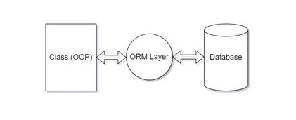
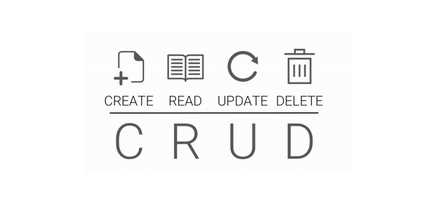
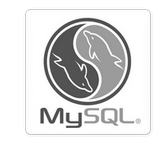
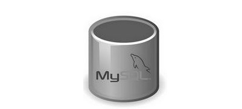
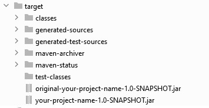
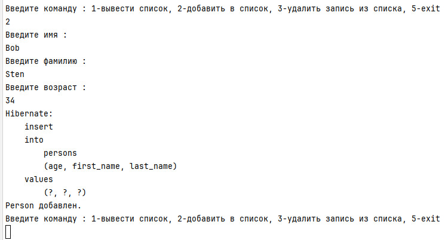
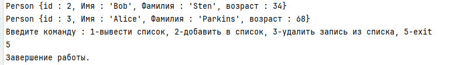
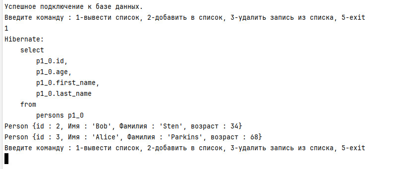

# Java Junior (семинары)
## Урок 3. Сериализация
### Задание 1: 
Создайте класс Person с полями name и age. 
Реализуйте сериализацию и десериализацию этого класса в файл.

### Задание 2: 
Используя JPA, создайте базу данных для хранения объектов класса Person. 
Реализуйте методы для добавления, обновления и удаления объектов Person.

<br><br><hr><hr>

### Общая информация

**JPA (Java Persistence API)** — это спецификация в Java, определяющая стандарты для работы 
с персистентностью данных, то есть для сохранения объектов в базе данных и их последующего извлечения. 
Она позволяет разработчикам абстрагироваться от конкретных реализаций баз данных и взаимодействовать с ними 
через объектно-реляционное отображение (ORM). 
Наиболее популярные и применяемые реализации JPA считаются Hibernate, EclipseLink, OpenJPA.


**Объектно-реляционное отображение (ORM)** — это технология программирования, 
позволяющая преобразовывать данные между реляционными базами данных и объектами в коде программы. 
ORM помогает разработчикам абстрагироваться от SQL-запросов и работать с базой данных через объекты, 
что упрощает разработку и улучшает читаемость кода.



**Сериализация** — это процесс преобразования состояния объекта в поток байтов, 
чтобы его можно было сохранить в файле или передать через сеть. 
В Java этот процесс реализуется с помощью интерфейса `Serializable`, который нужно реализовать в классе. 
Для записи объекта в файл используется класс `ObjectOutputStream`.

**Десериализация** — обратный процесс, когда из потока байтов восстанавливается состояние объекта. 
Для чтения объекта из файла применяется класс `ObjectInputStream`.

**Методы для работы с объектами в классе**:

Эти методы обеспечивают базовые операции CRUD (Create, Read, Update, Delete),
которые часто используются в работе с данными в объектах.



1. **Добавление объекта**: Метод, который добавляет новый объект в коллекцию или структуру данных внутри класса. 
Обычно такие методы называются `add()`, `insert()` или `create()`. <br>
Например:
   ```
   public void add(Person person) {
       persons.add(person);
   }
   ```

2. **Обновление объекта**: Метод, который изменяет свойства существующего объекта. Часто называется `update()`.<br> 
Пример:
   ```
   public void update(int id, Person updatedPerson) {
       for (int i = 0; i < persons.size(); i++) {
           if (persons.get(i).getId() == id) {
               persons.set(i, updatedPerson);
               break;
           }
       }
   }
   ```

3. **Удаление объекта**: Метод, удаляющий объект из коллекции или структуры данных. 
Называется `remove()`, `delete()`. <br>
Пример:
   ```
   public void remove(int id) {
       for (Iterator<Person> it = persons.iterator(); it.hasNext(); ) {
           Person person = it.next();
           if (person.getId() == id) {
               it.remove();
               break;
           }
       }
   }
   ```

<br><br>

## Решение задания

<hr>

### 1. 
Для реализации сериализации и десериализации класса Person создаем сам класс `Person`, 
реализуем интерфейс Serializable, что позволяет сохранять состояние объекта в бинарный поток.
Составляем метод `serialize`для записи в файл и метод `deserialize` для чтения объектов из файла. 
Для сериализации используем класс `ObjectOutputStream` - для записи в объект Person. 
Для десериализации используем метод `ObjectInputStream` - для чтения из объекта Person.

<br>

### 2. 
Для решения второго задания, используя JPA (Java Persistence API), 
потребуется настроить проект в IntelliJ IDEA Community Edition, 
добавить необходимые зависимости и реализовать операции CRUD (Create, Read, Update, Delete). <br>

Открыть проект в редакторе кода, например, IntelliJ IDEA и запустить проект Maven. 
Для этого требуется создать новый Maven-проект. <br>
В файле pom.xml добавить необходимые зависимости. <br>
Создать сущность - класс Person, который будет использоваться для отображения таблицы базы данных. <br>
Создать конфигурационный файл persistence.xml в папке src/main/resources/META-INF. <br>
Для настройки базы данных убедиться, что файл `persistence.xml` в директории `src/main/resources/META-INF` 
содержит правильные настройки подключения к базе данных:

```
<property name="jakarta.persistence.jdbc.url" value="jdbc:mysql://127.0.0.1:3306/persons"/>
<property name="jakarta.persistence.jdbc.user" value="root"/>
<property name="jakarta.persistence.jdbc.password" value="password"/>
```

Содержимое файла `persistence.xml`:

```
<?xml version="1.0" encoding="UTF-8"?>
<persistence version="3.0"
             xmlns="https://jakarta.ee/xml/ns/persistence"
             xmlns:xsi="http://www.w3.org/2001/XMLSchema-instance"
             xsi:schemaLocation="https://jakarta.ee/xml/ns/persistence https://jakarta.ee/xml/ns/persistence/persistence_3_0.xsd">
    <persistence-unit name="PersonPersistenceUnit" transaction-type="RESOURCE_LOCAL">
        <provider>org.hibernate.jpa.HibernatePersistenceProvider</provider>
        <class>org.example.task2.Person</class>
        <properties>
            <property name="jakarta.persistence.jdbc.url" value="jdbc:mysql://127.0.0.1:3306/persons"/>
            <property name="jakarta.persistence.jdbc.user" value="root"/>
            <property name="jakarta.persistence.jdbc.password" value="password"/>
            <property name="jakarta.persistence.jdbc.driver" value="com.mysql.cj.jdbc.Driver"/>
            <property name="hibernate.connection.characterEncoding" value="UTF-8"/>
            <property name="hibernate.connection.useUnicode" value="true"/>
            <property name="hibernate.connection.charSet" value="UTF-8"/>
            <property name="hibernate.dialect" value="org.hibernate.dialect.MySQLDialect"/>
            <property name="hibernate.hbm2ddl.auto" value="update"/>
            <property name="hibernate.show_sql" value="true"/>
            <property name="hibernate.format_sql" value="true"/>
        </properties>
    </persistence-unit>
</persistence>

```
Добавить необходимые зависимости в файл `pom.xml`: 
```
<?xml version="1.0" encoding="UTF-8"?>
<project xmlns="http://maven.apache.org/POM/4.0.0"
         xmlns:xsi="http://www.w3.org/2001/XMLSchema-instance"
         xsi:schemaLocation="http://maven.apache.org/POM/4.0.0 http://maven.apache.org/xsd/maven-4.0.0.xsd">
    <modelVersion>4.0.0</modelVersion>

    <groupId>org.example</groupId>
    <artifactId>your-project-name</artifactId>
    <version>1.0-SNAPSHOT</version>

    <properties>
        <maven.compiler.source>22</maven.compiler.source>
        <maven.compiler.target>22</maven.compiler.target>
        <project.build.sourceEncoding>UTF-8</project.build.sourceEncoding>
    </properties>

    <dependencies>
        <!-- Hibernate JPA -->
        
        <!-- MySQL Connector -->  
         
    </dependencies>

    <build>
        <plugins>
            <plugin>
                <groupId>org.apache.maven.plugins</groupId>
                <artifactId>maven-jar-plugin</artifactId>
                <version>3.3.0</version>
                <configuration>
                    <archive>
                        <manifest>
                            <mainClass>org.example.task2.AppClass</mainClass>
                        </manifest>
                    </archive>
                </configuration>
            </plugin>

            <plugin>
                <groupId>org.apache.maven.plugins</groupId>
                <artifactId>maven-shade-plugin</artifactId>
                <version>3.5.1</version>
                <executions>
                    <execution>
                        <phase>package</phase>
                        <goals>
                            <goal>shade</goal>
                        </goals>
                    </execution>
                </executions>
            </plugin>
        </plugins>
    </build>
</project>
```

Чтобы данные сохранялись в базе данных MySQL, необходимы некоторые действия с базой данных.
<br><br><br>

   

## Настройка проекта Maven с использованием MySQL


### Шаг 1: Установка MySQL

1. **Проверка версии MySQL**: Проверить, что MySQL сервер установлен на компьютере, проверить версию `mysql --version`.
2. **Установить MySQL Server**: Если MySQL не установлен, скачать и установить его с официального сайта [MySQL](https://dev.mysql.com/downloads/).
3. **Запустите MySQL Workbench**
4. **Создать новое подключение**:
    - Нажать на значок "+" рядом с "MySQL Connections" на начальном экране.
    - Ввести имя подключения (например, `Local instance`).
    - Проверить, что поле "Hostname" установлено на `localhost`.
    - Установить порт `3306` (или другой порт, если MySQL сервер настроен иначе).
    - Ввести имя пользователя `root`.
    - Нажать "Test Connection", чтобы проверить подключение. Проверить, что сервер MySQL запущен и работает на порту `3306`. Если все настроено правильно, будет сообщение об успешном подключении.
    - Нажмите "OK", чтобы сохранить подключение.  
5. **Добавить MySQL в PATH**:
   - Если MySQL уже установлен, нужно добавить каталог MySQL `bin` в переменную окружения PATH системы.
   - Найти каталог MySQL `bin`, который обычно находится по адресу `C:\Program Files\MySQL\MySQL Server X.X\bin` (где `X.X` - это версия MySQL).
   - Добавить этот каталог в переменную окружения PATH:
      - Щелкнуть правой кнопкой мыши на **This PC** или **Компьютере** на рабочем столе или в проводнике файлов.
      - Выберать **Свойства**.
      - Нажать на **Дополнительные системные настройки**.
      - В окне "Свойства системы" нажать на кнопку "Переменные среды".
      - В окне "Переменные среды" найти переменную "Путь" в разделе "Системные переменные", выбрать ее и нажать "Редактировать".
      - Нажать **Создать** и добить путь к каталогу MySQL `bin`, например, `C:\Program Files\MySQL\MySQL Server 8.0\bin`.
      - Нажать **ОК**, чтобы закрыть все окна.

6. **Запустить команду из каталога MySQL bin.**:
   - Кроме того, можно перейти в каталог MySQL `bin` с помощью командной строки и запустить оттуда команду `mysql`. Например:
     ```shell
     cd C:\Program Файлы\MySQL\MySQL Server 8.0\bin
     mysql -u root -p -h 127.0.0.1 -P 3306
     ```

7. **Проверить службу MySQL**:
   - Проверить, что служба MySQL запущена, запустив из любого места на компьютере в консоли команду `mysql --version`.
   
 <br>  

### Шаг 2: Настройка базы данных

1. **Создать базу данных**: Можно использовать SQL-скрипт `init.sql` для создания базы данных и таблицы. Можно выполнить этот скрипт через MySQL Workbench или командную строку MySQL.
2. **Подключиться к серверу**: Дважды нажать на созданное подключение, чтобы открыть новое окно MySQL Workbench и подключиться к серверу.
3. **Открыть новый SQL-запрос**:
    - Нажать на значок молнии или выберите "File" -> "New Query Tab".
4. **Выполнить SQL-скрипт**:
    - Вставить SQL-скрипт для создания базы данных и таблицы:
   
   ```sql
   CREATE DATABASE IF NOT EXISTS jpa_tutorial;
   USE jpa_tutorial;
   CREATE TABLE IF NOT EXISTS persons (
       id BIGINT AUTO_INCREMENT PRIMARY KEY,
       first_name VARCHAR(255) NOT NULL,
       last_name VARCHAR(255) NOT NULL,
       age INT NOT NULL
   );
   ```   
   - Нажать на значок молнии, чтобы выполнить запрос. Если все прошло успешно, база данных и таблица будут созданы.
   
<br>   

### Шаг 3: Проверка создания базы данных

1. **Обновить список схем**: Нажать на значок обновления рядом с "Schemas" в левой панели, чтобы увидеть созданную базу данных `jpa_tutorial`.
2. **Проверить таблицу**: Развернуть схему `jpa_tutorial`, чтобы увидеть таблицу `persons`.
   Убедиться, что база данных `persons` действительно существует в MySQL сервере, можно подключившись к MySQL через командную строку или любой MySQL клиент и выполнив команду:
   ```
   SHOW DATABASES;
   ```
   Если базы данных `persons` нет в списке, нужно её создать.

3. **Создание базы данных:**
   Если база данных `persons` не существует, создать её с помощью следующей команды:
   ```
   CREATE DATABASE persons;
   ```   
<br>
   
### Шаг 4: Пересоздание базы данных

1. **Удаление старой базы данных:**
   - Подключиться к MySQL через командную строку или инструмент управления базами данных (например, MySQL Workbench).
   - Удалить старую базу данных:
     ```
     DROP DATABASE persons;
     ```

2. **Создание новой базы данных:**
   - Создать новую базу данных с тем же именем:
     ```sql
     CREATE DATABASE persons CHARACTER SET utf8mb4 COLLATE utf8mb4_general_ci;
     ```

3. **Настройка пользователя и прав доступа:**
   - Проверить, что у пользователя `root` (или другого пользователя, который используется) есть необходимые права доступа к базе данных.

<br>

### Шаг 5: Запуск приложения

1. **Запуск приложения:**
   - После пересборки проекта и создания новой базы данных запустить приложение с помощью команды:
     ```bash
     java -jar target/your-project-name-1.0-SNAPSHOT.jar
     ```

<hr><br><br><br>


### Необходимые настройки JDK

<hr>
1. **Проверка установленной версии JDK**:
   - Проверить, что установлена версия JDK, которая соответствует указанной в `pom.xml`. Для [Java 22](https://www.oracle.com/java/technologies/javase/jdk22-archive-downloads.html) вам нужно установить JDK 22.
   - Или можно скачать [JDK 22](https://jdk.java.net/java-se-ri/22) с официального сайта [Oracle](https://www.oracle.com/) или использовать [OpenJDK](https://openjdk.org/).

2. **Настройка переменной окружения `JAVA_HOME`**:
   - Убедиться, что переменная окружения `JAVA_HOME` указывает на правильную версию JDK.
   - Например, если JDK 22 установлен в `C:\Program Files\Java\jdk-22`, установить `JAVA_HOME` на этот путь.

3. **Обновление `pom.xml`**:
   - Убедиться, что в `pom.xml` указаны правильные версии для `maven.compiler.source` и `maven.compiler.target`.
   - Если нет JDK 22, можно изменить версию на установленную, например, 17:

   ```
   <properties>
       <maven.compiler.source>17</maven.compiler.source>
       <maven.compiler.target>17</maven.compiler.target>
   </properties>
   ```
   
<br>


### Необходимые настройки Maven

<hr>
1. **Установить Maven**:
    - Убедиться, что Maven установлен на компьютере. 
    - Или можно скачать и установить Maven с официального сайта [Apache Maven](https://maven.apache.org/download.cgi).

2. **Переменные окружения**:
    - Убедиться, что путь к Maven добавлен в переменную окружения `PATH`. Это позволяет выполнять команду `mvn` из любой директории.
    - **Добавить Maven в PATH на Windows**:
        1. Найти папку, где установлен Maven, например, `C:\apache-maven-3.9.9\bin`.
        2. Открыть "Панель управления" -> "Система и безопасность" -> "Система" -> "Дополнительные параметры системы".
        3. Нажать "Переменные среды" и добавить путь к Maven в переменную `PATH`.

3. **Проверка установки**:
    - После установки и настройки переменных окружения открыть новый терминал или командную строку и выполнить команду:
      ```bash
      mvn -v
      ```
    - Эта команда должна вывести версию Maven, если он установлен правильно. <br>
    
    - После изменения переменных окружения необходимо перезапустить терминал, <br>редактор кода или командную строку, чтобы изменения вступили в силу. <br>

    - После указанных действий можно успешно выполнить команду `mvn clean install`. 
4. **Очистка проекта:**
   - Если необходимо заменить сборку проекта, в командной строке в корневой директории проекта Maven выполнить команду для очистки проекта:
     ```bash
     mvn clean
     ```
   - Чтобы очистить кэш Maven, можно выполнить команду:
     ```bash
     mvn dependency:purge-local-repository -DreResolve=true
     ```


5. **Пересборка проекта:**
   - После очистки выполнить команду для сборки проекта. <br>Эта команда соберет проект, скачает все необходимые зависимости и установит его в локальный репозиторий Maven:
     ```bash
     mvn install
     ```

<br><br>

## Работа приложения
<hr>

После создания проекта Maven с помощью команды `mvn clean install`, в папке target должны появится файлы с расширением .jar для запуска проекта: <br>


1. **Запустить приложение можно с помощью команды**:
```bash
java -jar target/your-project-name-1.0-SNAPSHOT.jar
```
- Раюота консмольного приложения: <br>
 <br>
2. **Выполнять действия с базой данных из консольного меню программы**:
- Запись в базу данных persons: <br>
 <br><br>
- Вывод списка persons: <br>
 <br><br>
- Завершение работы программы: <br>
 <br><br>
3. **После повторного запуска программы и подключения к базе данных, список сохраняется**: <br>
 <br>


   
<br><br><br><br><hr><hr>


<hr><hr><br><br>